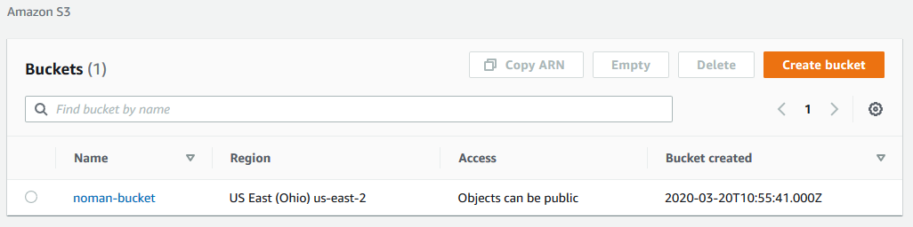
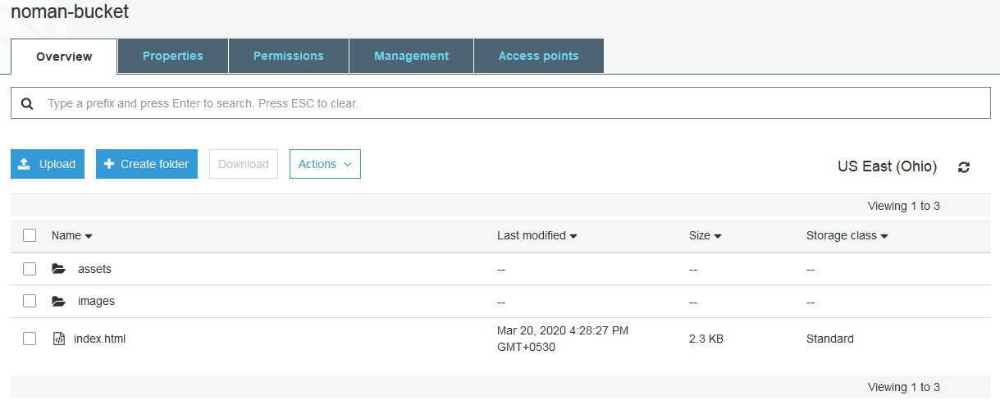
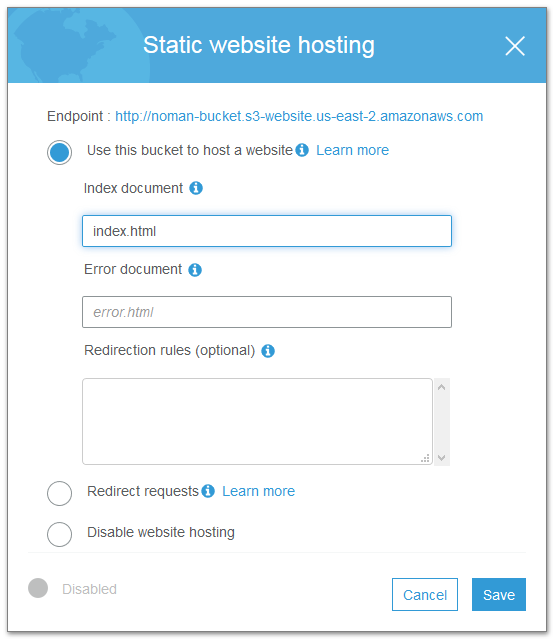
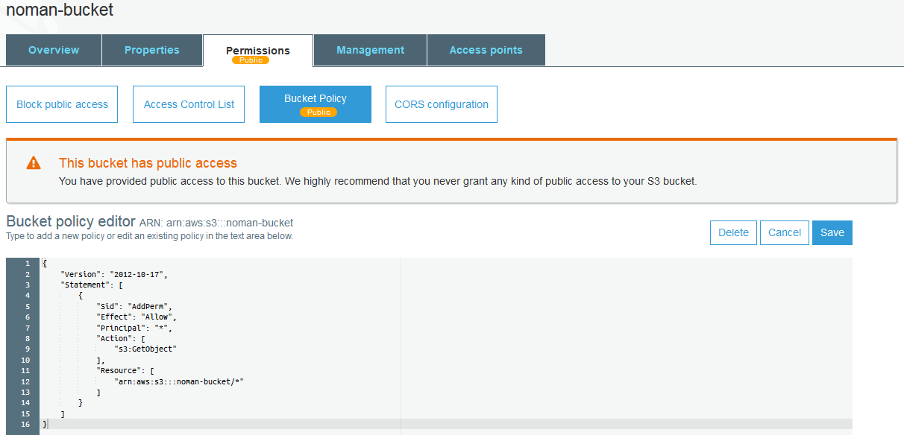
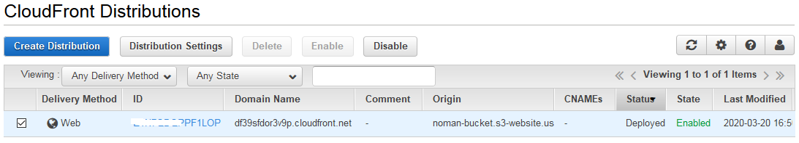

## Deploying a static website on AWS

### Step 01: Create S3 Bucket
First, We need to navigate s3 from AWS console. Let's create a s3 bucket here. I haved named it **noman-bucket**

### Step 02: Insert Files in the Bucket
Once a bucket is created, we may enter our website files here. Either AWS Cli can or web interface can be used to upload the files.

### Step 03: Enable Static Website Hosting
We have the website files in our bucket now. It's time to enable the static hosting. In order to do that, We have to select **Properties** tab inside the bucket and then select the **Static Website Hosting**. The index file should be navigated here.

### Step 04: Setup IAM Bucket Policy
To make the bucket contents publicly availabe we have to implement an IAM bucket policy. The policy can be found in the **Permissions** tab and under **Bucket Policy** sub tab. 

### Step 05: Website Distribution
The website should be distributed via CloudFront. For that, the s3 bucket must be connected to a web distribution in CloudFront. Once the connection has been setup properly the website will get an URL with **.cloudfront.net** domain. It will take a bit time to deploy. So, wait until the cloudfront console shows the status as **Deployed**.

**Congratulations!!!**
We have successfully hosted a static website on Amazon Web Services.
